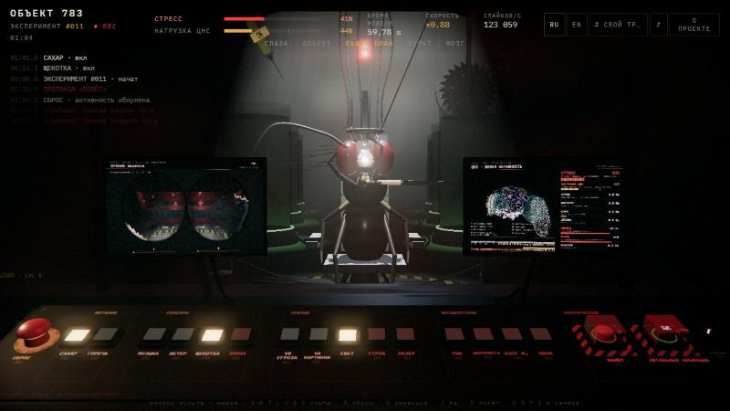
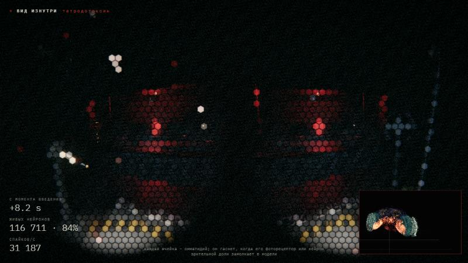
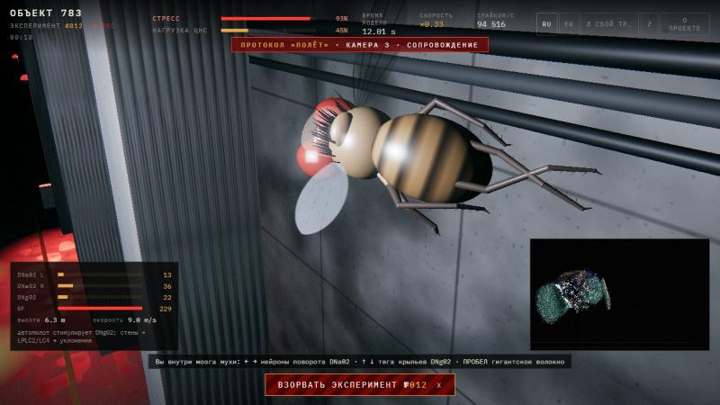
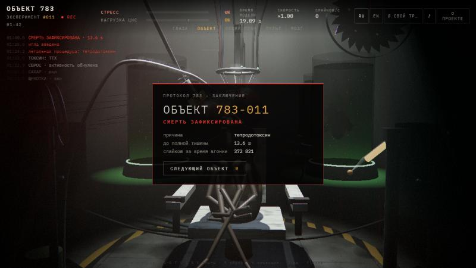

# Subject 783

**A whole fruit-fly brain, simulated live in your browser, in an underground lab where you experiment on it.**

**▶ Live: <https://rootvandal.github.io/subject-783/>** (desktop Chrome/Edge/Firefox, sound on; phones work in landscape)



| Death through the fly's eyes | Flight on its own descending neurons | Protocol closed |
|---|---|---|
|  |  |  |

You sit in a dark observation booth lit red. Behind the glass a fly is strapped into a chair under a flickering lamp, wired with electrodes. The 3D console in front of you has 15 experiments: feed it, play it music (yours, too: a file or a YouTube link), blow on its antennae, tickle it, strobe it, burn its eye with a laser, shock it, spin it in a centrifuge, gas it with nitrogen, cut off its legs with a saw. The right monitor shows its brain (138,639 real neurons at their real positions) firing in real time, with STRESS and CNS LOAD meters. The left monitor shows what it sees through its compound eyes.

Push it too hard and the brain overloads: a countdown starts, and if you don't press RESET the neurons burn out. Under a guarded switch there is a lethal injection (tetrodotoxin or a neonicotinoid); you then watch the death from inside, through the fly's eyes, as the ommatidia go dark one by one with the neurons behind them. Under another guard: FLIGHT. Sirens, the straps release, and the fly flies through the hall on its own descending neurons until you detonate the experiment. The next subject is wheeled in.

The brain is not an animation. It is the [FlyWire](https://flywire.ai) connectome (v783, 138,639 neurons, 54.5 M synapses) running the leaky integrate-and-fire model of [Shiu et al. 2024](https://www.nature.com/articles/s41586-024-07763-9), computed spike by spike in a Web Worker.

> 🇷🇺 **Коротко по-русски.** Полный мозг дрозофилы, все 138 639 нейронов из коннектома FlyWire, работает прямо в браузере. Модель та же, что в Nature 2024 (Shiu et al.), и с оригиналом она совпадает спайк в спайк. Вы в тёмной подземной лаборатории, за стеклом к креслу пристёгнута муха, перед вами 3D-пульт с 15 опытами: сахар, горечь, музыка (можно свою, файлом или ссылкой на YouTube), ветер, щекотка, VR, стробоскоп, лазер, ток, центрифуга, азот, пила. На правом мониторе вспыхивают её настоящие нейроны, на левом видно то, что видят её фасеточные глаза. Если перегрузить мозг, нейроны выгорают. Под защитной крышкой есть смертельная инъекция (тетродотоксин или неоникотиноид), и смерть видна изнутри, глазами мухи. Под другой крышкой кнопка «ПОЛЁТ»: муха летает по залу на собственных нисходящих нейронах, пока вы не взорвёте эксперимент. Сайт двуязычный (RU/EN). Модель не живая и ничего не чувствует; это проверка того, сколько поведения следует из одной лишь схемы связей.

---

## What actually happens when you press a button

| Experiment | Neurons driven (Poisson input) | What the full model does |
|---|---|---|
| **Sugar** | 32 labellar sugar GRNs, rate scaled by hunger | proboscis motor neuron **MN9 fires ~75 Hz**; the fly extends its proboscis and drinks |
| **Bitter** | 42 bitter GRNs | MN9 stays silent; with sugar at the same time, **bitter suppresses feeding (MN9 0 Hz)** |
| **Music** | 358 Johnston's-organ neurons (JO-A/B), rate = live loudness of whatever plays | auditory neurons up to ~39 Hz, and the **giant fiber fires**: loud sound startles the fly |
| **Wind** | 433 JO-C/E neurons (antennal deflection) | grooming descending neurons at ~30 Hz: the fly cleans its antennae |
| **Tickle** | 1,417 head-bristle mechanosensory neurons | grooming descending neurons at ~69 Hz |
| **Shock** | 1,736 ascending neurons (body signals) | ~2,600 brain cells respond; "body alarm" descending neurons at ~63 Hz |
| **VR: threat** | 314 loom detectors (LPLC2, LC4), driven by a looming disc | **giant fiber + escape descending neurons at ~160 Hz** |
| **VR: images, lamp, strobe** | 10,582 photoreceptors (R1–R8), per-eye rate from brightness | optic-lobe cells respond; the strobe hits every photoreceptor at once |
| **Laser** | photoreceptors of the left eye | after 1.5 s the cells in the spot are **blocked for good**; their ommatidia go dark on the vision monitor |
| **Centrifuge** | JO-C/E plus optic flow | grooming and visual circuits |
| **Odor** ⚠ | 229 olfactory receptor neurons (DM1, DM2, DM4, VA2) | **the model breaks**: a self-sustaining discharge (~7,900 cells, ~480 k spikes/s) keeps going after the odor is gone and drives the CNS into overload. Press RESET |
| **Flight** | DNa02 L/R (steering), DNg02 L/R (wing power), giant fiber; LPLC2/LC4 per side when a wall looms | one-sided looming fires the **same-side giant fiber harder** and the **opposite DNa02**: the brain itself turns the fly away from the wall |

Rates come from the offline full-brain runs in `data/brain.json` (`scenarios`). The grooming and body-alarm readouts are chosen from the data: the descending neurons that respond most to wind/tickle and to the shock input in the full model. The odor failure is real model behaviour, not a bug in this port: the model has no neuromodulation, gap junctions or detailed inhibition dynamics, and the recurrent antennal-lobe / mushroom-body loop runs away. CO₂ and thermosensory input ignite the same runaway, so they are not on the console. We kept odor because a demo that shows where a model breaks is more honest than one that hides it.

## Our interventions (not in the Shiu model)

The original model has no damage and no poisons. Everything below sits on top of it, uses only two mechanisms, and is off unless you trigger it:

- **Blocking a neuron**: it becomes permanently unexcitable (no spikes, no input). The worker applies blocks on a schedule at exact simulation times.
- **Excitatory gain**: a multiplier on excitatory synapses.

| Feature | How it is computed |
|---|---|
| **CNS load / overload** | spikes/s of every non-stimulated neuron; 100 % = 60,000/s. Above 100 % a countdown starts; without RESET the most over-excited neurons burn out (blocked) first. The threshold is ours; the discharge is the model's. |
| **Tetrodotoxin** | blocks sodium channels → a wave of blocking from the neck, where the toxin reaches the brain with the hemolymph |
| **Neonicotinoid** | an agonist of nicotinic ACh receptors, the main excitatory transmitter in insects → excitatory gain ×1.5 plus drive from the body. The network goes into seizure; a neuron that fires 25 spikes in it dies (excitotoxicity) |
| **Nitrogen (N₂)** | anoxia → a wave of spreading depolarisation, then coma: a reversible blocking wave. Oxygen brings the neurons back; past 40 s the fly dies |
| **Saw** | legs and wings reach the brain only through the ventral nerve cord, which the model lacks, so a cut is an injury volley on the ascending body neurons. An antenna is on the head: its Johnston's-organ neurons discharge and then go silent, so music and wind reach the brain through the other antenna only |
| **Death through the eyes** | two cameras in the head render a hexagonal compound-eye image; each ommatidium is tied to one photoreceptor and one optic-lobe neuron and goes dark when the model blocks them |

**Flight is a hybrid.** The model has no body or ventral nerve cord, so the brain's outputs drive a simple flight model: yaw from the left/right difference of DNa02 firing, thrust and lift from DNg02, a sharp evasive manoeuvre from a giant-fiber volley. An autopilot stimulates DNg02 to hold altitude; the arrow keys inject spikes into DNa02/DNg02, Space into the giant fiber. Wall proximity drives LPLC2/LC4 on that side.

**What this is not.** "Fear", "interest", "stress", "hunger" are labels for circuits, not measured emotions. Hunger is an interface variable. The model has no learning, memory, neuromodulators or body; it does not feel pain, and nothing in it could "think it is alive". What is striking is how much behaviour follows from the wiring alone. The explosion, the specimen tanks and the figure at the back of the hall are theatre.

## Verification

Every claim below is reproducible with the scripts in `pipeline/` and `tools/`.

| Check | Result |
|---|---|
| numpy port vs the original **Brian2** model, deterministic whole-brain drive, 200 ms (`pipeline/test_vs_brian2.py`) | **3,450 / 3,450 spikes identical**, 0 extra, 0 missing |
| numpy port vs the published reference run (21 sugar GRNs, 10 vs 30 trials, `pipeline/validate.py`) | firing-rate correlation **r = 0.9997**; MN9 92.1 Hz vs 93.3 Hz; top-20 neurons 20/20 |
| browser event-driven engine vs dense stepper, same seed (`tools/bench.html`) | **identical spike counts in every neuron** (sugar, loom, odor) |
| browser engine vs Python, spikes/s per scenario | sugar 19,250 vs 19,821 · loom 85,210 vs 85,318 · light 430 k vs 430 k |

Two subtleties had to be matched to get the exact Brian2 behaviour: synaptic input arriving while a cell is refractory is **discarded**, and integration resumes **one step after** the nominal refractory period ends.

## How it runs in a browser

- **Event-driven exact integration.** Between inputs a neuron obeys a linear ODE with a closed-form solution. The worker updates a neuron only when a spike or stimulus reaches it, then solves analytically for the first future 0.1 ms step at which it crosses threshold and schedules that spike on a timing wheel. Cost scales with synaptic events, not neurons × timesteps: about 10× faster than stepping, with identical output.
- **Exact pruning.** In this model a neuron influences the network only when it spikes. We ran every experiment (and all of them at once) on the **full** connectome offline and kept the outgoing synapses of the 35,187 neurons that spiked or came within 2 mV of threshold: 4.24 M connections, 19.8 M synapses, 9.8 MB gzipped (shipped as 0.9 MB slices of one gzip stream that the worker downloads in parallel and joins). All 138,639 neurons still exist and receive input.
- **A bug worth knowing about.** Stimulus envelopes decay smoothly and approach zero without reaching it. Near 10⁻¹⁵ Hz, `log(1 − p)` in the geometric-skip Poisson sampler rounds to 0 and the loop never terminates, which froze the worker. Fixed with `log1p` plus a floor on rates, on both sides of the worker boundary.
- **Rendering.** three.js r170, everything procedural (no 3D assets). Shaders are compiled and textures uploaded during the title sequence, so the dive lands straight in the lab. Bloom at half resolution, a film-grade pass, an instanced 3D console.
- **Sound.** Everything is synthesised with Web Audio: drone, spike-monitor crackle, saw, heartbeat, tinnitus. The fly hears the real loudness of the music: the built-in track and your own files through an analyser; YouTube through the microphone (analysed locally, never sent anywhere), because the embedded player does not expose its audio. Without a microphone the fly hears a stand-in beat.
- **Throughput** (sim-time / wall-time, one core, desktop): most experiments run in real time; the looming threat and the strobe slow down; the odor runaway and the neonicotinoid seizure drop well below real time, and the HUD shows a slowed-down clock instead of pretending.

## Controls

The console buttons are clickable; hover for a description. Keys:

| | |
|---|---|
| `1`–`9`, `0` | sugar, bitter, music, wind, tickle, VR threat, VR images, odor, shock, lamp |
| `T` `L` `C` `N` `V` | strobe, laser, centrifuge, nitrogen, saw |
| `J` / `K` | choose the toxin / lethal injection (press twice: guard, then switch) |
| `F` | flight (press twice); in flight arrows / WASD steer, `Space` giant fiber, `X` detonate |
| `R` | reset; after a death, next subject |
| `Q` `E` `S` `P` `W` | eyes monitor, brain monitor, subject, console, overview |

Your own music: the **♫** button at the top (a YouTube link or a file), or drop an audio file onto the window.

## Run it locally

No build step. Use the bundled server (no caching, correct MIME types for ES modules on Windows):

```bash
python tools/serve.py
```

Then open <http://localhost:8783>. Append `#lab` to skip the intro. Any static server works too (`python -m http.server`).

## Rebuilding the data

```bash
git clone --depth 1 https://github.com/philshiu/Drosophila_brain_model raw/shiu
curl -L -o raw/annotations.tsv https://raw.githubusercontent.com/flyconnectome/flywire_annotations/main/supplemental_files/Supplemental_file1_neuron_annotations.tsv
pip install -r pipeline/requirements.txt
cd pipeline
python build_data.py        # ~5 min: full-brain scenarios, writes ../data/
python validate.py 10       # statistical check against the published reference
python test_vs_brian2.py    # spike-for-spike check against Brian2 (needs brian2)
```

`tools/bench.html` (served from the repo root) runs the engine-vs-dense comparison and the throughput table in the browser.

## Project layout

```
index.html, css/          page, HUD, about dialog (RU/EN)
js/main.js                wiring: experiments -> worker rates, spikes -> visuals; deaths, saw, flight, music
js/sim/worker.js          event-driven whole-brain LIF engine (+ dense reference mode, blocks, gain)
js/brain.js               138,639-point neuron cloud, spike flashes in the shader
js/intro.js               WebGL title sequence
js/pov.js                 compound-eye view (two cameras -> hexagonal facets tied to neurons)
js/scene/                 procedural lab, 3D console, fly, monitors
js/audio.js, js/vr.js     synthesised sound, music analysis; VR stimuli and their neural drive
pipeline/                 numpy port of the model, data build, validation, Brian2 test
data/                     neurons.bin.gz, synapses.bin.gz.000-011, brain.json (generated)
tools/                    dev server, engine bench
vendor/three/             three.js r170 + addons (MIT), vendored so the site works offline
```

## Credits

- Connectome: Dorkenwald S. et al. *Neuronal wiring diagram of an adult brain.* Nature 634, 124–138 (2024). FlyWire consortium.
- Cell types and positions: Schlegel P. et al. *Whole-brain annotation and multi-connectome cell typing of Drosophila.* Nature 634, 139–152 (2024). [flyconnectome/flywire_annotations](https://github.com/flyconnectome/flywire_annotations).
- Model: Shiu P. K. et al. *A Drosophila computational brain model reveals sensorimotor processing.* Nature 634, 210–219 (2024). [philshiu/Drosophila_brain_model](https://github.com/philshiu/Drosophila_brain_model) (MIT).
- Steering and flight neurons: Rayshubskiy A. et al. (2020), bioRxiv (DNa02); Namiki S. et al. *Curr. Biol.* 32 (2022) (DNg02).
- 3D: [three.js](https://threejs.org) (MIT). Font: IBM Plex Mono (OFL), via Google Fonts.

The data files in `data/` are derived from the FlyWire connectome and annotations. If you reuse them, cite the papers above and check [codex.flywire.ai](https://codex.flywire.ai) for the current data-use terms. Code in this repository is MIT-licensed (see `LICENSE`).

This is an educational project made for a school IT defence. The fly is a simulation; no insects were harmed. Whether a simulated brain can be "harmed" is a fair question for the defence.
